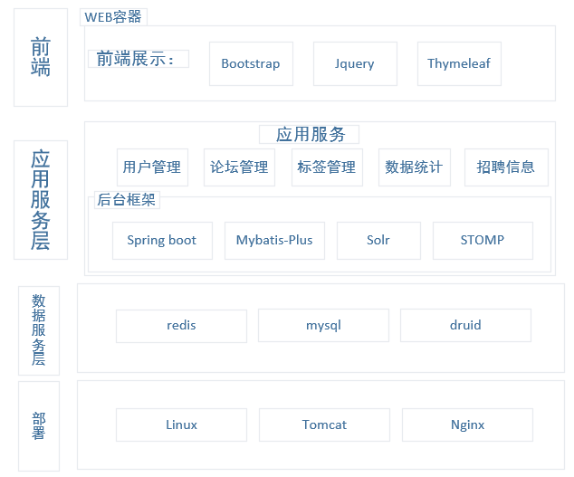
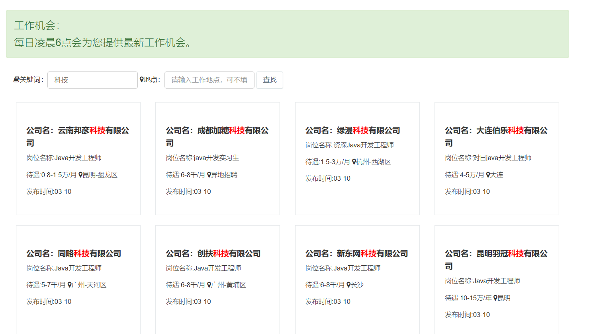
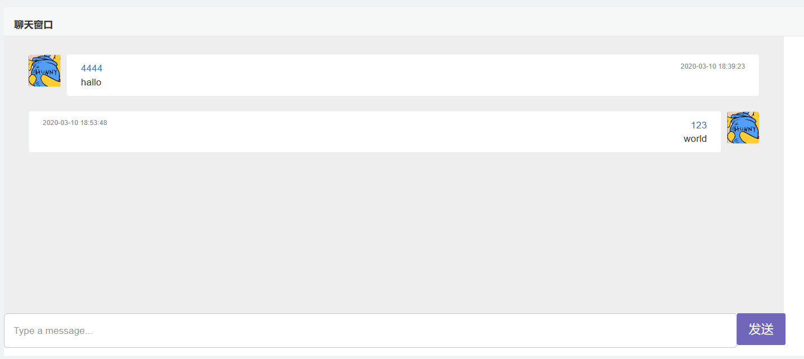
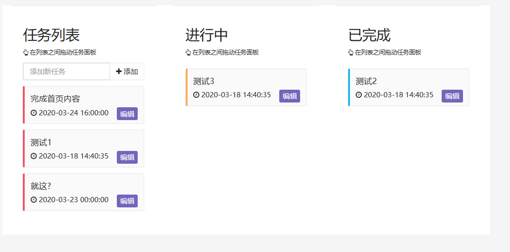
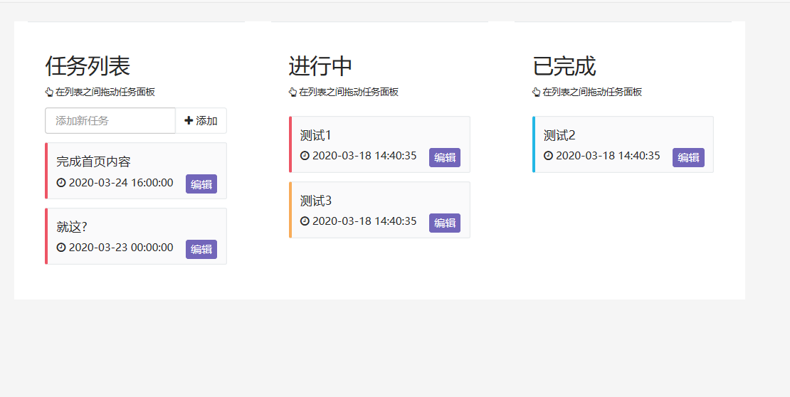

# 简单 Q&A 论坛社区
## 项目总体架构：

## 功能介绍：
1. 本问答社区提问全部采用MarkDown格式。利用editor.md插件来保证用户的便利

2. 利用爬虫技术每日6点爬取51job上的照片信息，并放入Solr索引中(大体的搜索都是利用Solr引擎)，借此来提高搜索效率

3. 敏感词过滤则是利用DFA技术（前缀树的原理），进行敏感词过滤。并将敏感词利用🤐进行替换（在数据库中修改的是html格式数据（展示层），而Markdown格式的没有改动）
4. 利用WebSocket（基于Stomp协议）实现用户在线聊天功能

5. 仿github中的项目管理(利用redis存用户的改动数据，然后利用定时任务插入数据库，避免数据库的频繁改动)
